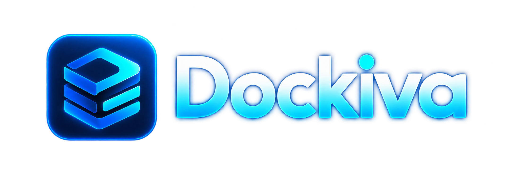

<p align="center">
  
</p>

# Dockiva

Dockiva is a lightweight, cross-platform desktop environment for managing local containers. It combines a Go and Wails core with a Vue interface and supports both platform-native runtimes and existing Docker endpoints.

Dockiva is open source under the [Apache License 2.0](LICENSE). Contributions
are welcome; read [CONTRIBUTING.md](CONTRIBUTING.md) before opening a pull
request. Report suspected vulnerabilities privately according to
[SECURITY.md](SECURITY.md).

Every pull request runs the frontend build and Go test suite. Dependabot checks
Go, npm, and GitHub Actions dependencies weekly.

> [!IMPORTANT]
> Dockiva is under active development. Native macOS and Windows engines still require target-platform validation before production use.

## Highlights

- Clean, native-feeling desktop control center
- Persistent light and dark appearance modes
- Container start, stop, restart, delete, logs, terminal, and inspect tools
- Docker Compose import, grouping, project actions, builds, and rebuilds
- Live CPU, memory, PID, port, and networking information
- Image, volume, network, disk-usage, and prune tools
- Dynamic tray and menu-bar controls with event-driven refresh
- Explicit runtime selection with stable endpoint identity
- Optional external Docker support without silently switching engines

## Dockiva compared with OrbStack and Docker Desktop

Dockiva is not trying to copy every feature in either product. Its current
advantage is a focused, inspectable container control plane that can use a
Dockiva-managed runtime or an existing Docker/Moby endpoint without silently
changing which engine owns your data.

| Capability | Dockiva | OrbStack | Docker Desktop |
| --- | --- | --- | --- |
| Host platforms | macOS, Linux, and Windows; native-backend maturity varies | Focused on macOS | macOS, Linux, and Windows |
| Runtime choice | Explicit Dockiva Native or saved external endpoint | Integrated Docker-compatible engine and Linux machines | Bundled Docker Engine with platform VM/WSL integration |
| Container UI | Lifecycle, Compose projects, logs, terminal, inspect, stats, images, volumes, and networks | Containers, Compose, Kubernetes, Linux machines, and host file access | Containers, images, volumes, builds, logs, Kubernetes, Docker Hub, and Extensions |
| Storage workflow | Reviews container storage folders and offers scoped build-cache, unused-resource, and deep-clean choices | Dynamic disk plus container/image/volume file access and Docker Desktop migration | Image/volume cleanup, disk-image controls, and Resource Saver |
| Engine identity | Keeps native and external stores separate and shows the active endpoint | Supports Docker contexts and side-by-side migration | Uses Docker Desktop's managed engine/context |
| Kubernetes | Not implemented | Included | Included |
| Product maturity | Active development; native engines still being validated | Established macOS product | Established cross-platform product and ecosystem |

Choose Dockiva when explicit engine ownership, a compact container-focused UI,
and a cross-platform native-runtime direction matter more than an all-in-one
Kubernetes, registry, AI, extensions, or general Linux-machine suite. Choose
OrbStack when you want its highly optimized macOS container and Linux-machine
experience today. Choose Docker Desktop when you need Docker's complete,
supported ecosystem and organization features.

Comparison references: [OrbStack overview](https://docs.orbstack.dev/),
[OrbStack migration and contexts](https://docs.orbstack.dev/install),
[Docker Desktop overview](https://docs.docker.com/desktop/), and
[Docker Desktop dashboard](https://docs.docker.com/desktop/use-desktop/).

## Runtime architecture

```text
                       Dockiva UI and Go core
                                  │
                          ContainerRuntime
                                  │
              ┌───────────────────┼───────────────────┐
              │                   │                   │
            Linux               macOS               Windows
              │                   │                   │
        containerd/runc     Virtualization.framework  WSL2
                                  │                   │
                           Linux guest          Dockiva guest
                                  │                   │
                      dockerd/containerd/runc   dockerd/containerd/runc
```

External Docker and Moby endpoints remain available on supported platforms.
Dockiva Native exposes its own Docker-compatible API endpoint; it is a
separate engine and never overwrites the selected External Docker endpoint.

## Platform status

| Platform | Backend | Status |
| --- | --- | --- |
| Linux | Direct containerd in the `dockiva` namespace | Implemented; CNI networking requires one-time helper installation |
| macOS | Apple `Virtualization.framework` VM | Implemented; requires Linux-generated kernel and root filesystem assets |
| Windows | Dedicated Dockiva WSL2 guest | Experimental; native runtime parity remains in progress |
| All | External Docker/Moby endpoint | Supported |

Docker Compose orchestration currently requires the Docker runtime. The macOS
native guest now includes the Docker Engine foundation (`dockerd` over its own
local socket); target-macOS validation is still required before release.

## Docker contexts and migration

Dockiva Native and an existing Docker Desktop/System Docker installation are
separate container stores. Use separate Docker contexts rather than trying to
merge live engines:

```text
docker context: dockiva       -> Dockiva Native
docker context: desktop-linux  -> Docker Desktop
```

The planned **Migrate Docker Data to Dockiva** flow is explicitly opt-in. It
will inventory images, containers, volumes, and Compose projects; show disk and
compatibility checks; copy supported data to Dockiva Native; and verify the
result. It will never delete, alter, or silently switch the source Docker
engine. Persistent-data migration requires macOS/Windows target validation and
is not claimed as complete by this Linux build.

## Requirements

- Go 1.26.3 or newer
- Node.js and npm
- Wails v3 beta.19

Install the matching Wails CLI:

```bash
go install github.com/wailsapp/wails/v3/cmd/wails3@v3.0.0-beta.19
```

Then install frontend dependencies:

```bash
cd frontend
npm ci
cd ..
```

## Development

Run the Wails development environment:

```bash
wails3 task dev
```

The reliable Linux GTK3 path is:

```bash
wails3 build -tags gtk3
./bin/dockiva
```

Frontend-only development:

```bash
cd frontend
npm run dev
```

## Build

### Versioning and in-app updates

`VERSION` is the product-version source of truth. It contains a semantic version
without the `v` prefix, for example:

```text
0.1.0
```

Production builds embed that version together with the current Git commit and
UTC build date. The macOS build also writes the version into the app bundle;
`CFBundleVersion` defaults to the Git commit count and may be overridden in CI:

```bash
DOCKIVA_BUILD_NUMBER=42 ./scripts/build-macos.sh arm64 \
  --guest-assets ./macos-guest
```

The Engine Settings page shows the installed version and includes **Check for
Updates**. Dockiva reads the latest public release from
`Tomnerb/Dockiva` and compares its `vX.Y.Z` tag with the installed version. If
an update exists, **Update & Restart** downloads the matching archive inside
the app, verifies it against the release's `SHA256SUMS`, stages the replacement,
quits Dockiva, atomically replaces the installed app, and launches the new
version. The original installer remains available as a manual fallback.

For a release, update `VERSION`, commit it, build the release installers, then
publish a GitHub release with the matching tag, such as `v0.2.0`. A macOS
release build produces all three files needed for distribution:

```text
dist/macos-ARCH/Dockiva-VERSION-macOS-ARCH.dmg
dist/macos-ARCH/Dockiva-VERSION-darwin-ARCH.zip
dist/macos-ARCH/SHA256SUMS
```

Upload the `.dmg`, updater `.zip`, and `SHA256SUMS` to the same GitHub Release.
The `darwin` and architecture tokens in the updater archive name are required
so Dockiva selects the correct asset. Never publish an updater archive without
its matching checksum file. When Apple credentials are configured, the archive
contains the signed, notarized, and stapled `Dockiva.app`. An unsigned release
instead contains an ad-hoc-signed app and may be blocked by Gatekeeper until the
user explicitly allows it. Updating `VERSION` always requires rebuilding the
release artifacts.

### Automated GitHub release

The [release workflow](.github/workflows/release.yml) runs when a stable
`vX.Y.Z` tag is pushed. It verifies that the tag matches `VERSION`, runs the
frontend and Go tests, builds the macOS native guest, produces signed-or-unsigned
macOS and Windows releases, and the Linux updater archive,
creates one combined `SHA256SUMS`, and publishes the GitHub Release. It can also be rerun manually
from **Actions → Release → Run workflow** with an existing tag.
The current automated targets are macOS arm64 (Dockiva Native), macOS amd64
(external Docker engine), Windows amd64, and Linux amd64/arm64.

Configure these optional GitHub Actions environment secrets to sign releases:

| Secret | Value |
| --- | --- |
| `MACOS_CERTIFICATE` | Optional: base64-encoded Developer ID Application `.p12` |
| `MACOS_CERTIFICATE_PASSWORD` | Password used when exporting the `.p12` |
| `MACOS_SIGN_IDENTITY` | Full `Developer ID Application: … (TEAM_ID)` identity |
| `APPLE_ID` | Apple Account used for notarization |
| `APPLE_TEAM_ID` | Apple Developer team ID |
| `APPLE_APP_PASSWORD` | App-specific password used by `notarytool` |
| `WINDOWS_CERTIFICATE` | Optional: base64-encoded Authenticode `.pfx` |
| `WINDOWS_CERTIFICATE_PASSWORD` | Optional: password for the `.pfx` |

Create GitHub environments named `release-macos`, `release-windows`, and
`release-publish`. Store platform signing secrets in their matching environment
instead of as unrestricted repository secrets. Restrict deployments to version
tags matching `v*.*.*`; optional required reviewers add a manual release gate,
while leaving reviewers empty preserves fully automatic tagged releases.
Protect `main` and release tags, and enable private vulnerability reporting
under **Settings → Security**. The workflow pins third-party actions to reviewed
commit SHAs so a mutable action tag cannot change release code.

Then publish a release by changing and committing `VERSION` before creating the
matching tag:

```bash
git add VERSION
git commit -m "chore(release): prepare v0.2.0"
git push origin main
git tag v0.2.0
git push origin v0.2.0
```

The six Apple secrets must either all be configured or all be absent. Without
them, the workflow publishes an ad-hoc-signed macOS app and unsigned DMG; the
updater still verifies `SHA256SUMS`, but Gatekeeper may block first launch. Add
all six secrets later to enable Developer ID signing and notarization.

The two Windows secrets are optional, but they must either both be configured
or both be absent. Without them, the workflow publishes an unsigned executable
and installer; in-app updates still require and verify `SHA256SUMS`, but Windows
shows an unknown publisher and may display SmartScreen warnings. Add the two
secrets later to enable Authenticode signing without changing the release flow.

The release is published only after every platform job succeeds. Windows uses
a per-user installer under `%LOCALAPPDATA%` so the in-app updater can replace
the packaged executable without an administrator prompt. Linux self-update works
when the extracted `dockiva` binary is installed in a user-writable location,
such as `~/.local/bin`; system package upgrades should continue through the
system package manager.

### macOS

An external-Docker-only build needs only macOS. Use `arm64` for Apple silicon
or `amd64` for Intel:

```bash
./scripts/build-macos.sh arm64 --external-only
./scripts/build-macos.sh amd64 --external-only
```

The native engine additionally needs `vmlinux` and `rootfs.ext4`. Generate them once on Linux:

```bash
./scripts/build-macos-guest-assets-linux.sh
```

Copy the resulting `macos-guest` directory to the Mac, then build and optionally install:

```bash
./scripts/build-macos.sh arm64 \
  --guest-assets /path/to/macos-guest \
  --install
```

Output:

```text
dist/macos-arm64/Dockiva.app
```

The bundled native engine currently supports Apple silicon only. Intel Mac
builds use an external Docker-compatible engine, such as Docker Desktop. The
`--install` option copies the completed application to
`~/Applications/Dockiva.app`; without it, the application remains in `dist/`
and can be copied to `Applications` manually.

#### Create a macOS DMG installer

Build the application first, then create the DMG from the completed app bundle:

```bash
./scripts/build-macos.sh arm64 \
  --guest-assets /path/to/macos-guest
wails3 task darwin:create:dmg
```

For an external-Docker-only DMG:

```bash
./scripts/build-macos.sh arm64 --external-only
wails3 task darwin:create:dmg
```

Output:

```text
bin/dockiva.dmg
```

Use `darwin:create:dmg` after `build-macos.sh`. The higher-level
`darwin:package:dmg` task rebuilds the application and can replace the native app
bundle before the VMM helper and guest assets are injected. A native DMG contains
`dockiva-vmm`, `vmlinux`, and `rootfs.ext4`; an external-only DMG is smaller but
requires an existing Docker or Moby endpoint.

Verify and open the image on macOS with:

```bash
hdiutil verify bin/dockiva.dmg
open bin/dockiva.dmg
```

Development and unsigned-release bundles are ad-hoc signed. Public distribution
is smoother and establishes publisher identity when an Apple Developer ID
Application certificate, hardened runtime, notarization, and stapling are used.
Without them, clearly label the release unsigned and expect Gatekeeper warnings.

Create an unsigned DMG and updater archive with:

```bash
./scripts/build-macos.sh arm64 \
  --guest-assets ./macos-guest \
  --unsigned-release
```

#### Create a signed and notarized release DMG

Install a `Developer ID Application` certificate and its private key in the
login keychain. Store notarization credentials once; use an app-specific password
instead of the Apple Account password:

```bash
xcrun notarytool store-credentials "dockiva-notary" \
  --apple-id "YOUR_APPLE_ID" \
  --team-id "YOUR_TEAM_ID" \
  --password "YOUR_APP_SPECIFIC_PASSWORD"
```

Then run the release build with the exact identity shown by
`security find-identity -v -p codesigning`:

```bash
./scripts/build-macos.sh arm64 \
  --guest-assets ./macos-guest \
  --release \
  --sign-identity "Developer ID Application: YOUR NAME (TEAM_ID)" \
  --notary-profile "dockiva-notary"
```

The script signs the nested VMM helper with its Virtualization entitlement,
signs the application with hardened runtime and a secure timestamp, notarizes
and staples the application, then creates, signs, notarizes, and staples
`bin/dockiva.dmg`. Credentials remain in Keychain and are never written to the
repository. `DOCKIVA_SIGN_IDENTITY` and `DOCKIVA_NOTARY_PROFILE` may be used
instead of their corresponding command-line options.

### Linux

```bash
./scripts/build-linux.sh amd64
./scripts/build-linux.sh arm64
```

Output:

```text
dist/linux-amd64/dockiva
dist/linux-arm64/dockiva
```

Install direct-containerd networking once when using the native Linux runtime:

```bash
sudo ./scripts/install-containerd-networking.sh
```

### Windows

Cross-build the executable from macOS or Linux:

```bash
./scripts/build-windows.sh amd64
```

To build the current NSIS application installer, run the following commands on
Windows with Wails and NSIS installed:

```powershell
wails3 build GOOS=windows GOARCH=amd64
.\scripts\package-windows.ps1
```

The generated installer is written under `bin/`; its name follows the Wails
application configuration, normally `dockiva-amd64-installer.exe`. This
installer installs the desktop application, WebView2 runtime when needed, Start
Menu and desktop shortcuts, and an uninstaller. It does not currently provision
the native WSL2 guest automatically.

The dedicated WSL2 guest root filesystem must currently be generated on Linux:

```bash
./scripts/build-windows-wsl-rootfs-linux.sh
```

Copy `dist/windows-wsl/dockiva-wsl-rootfs.tar` to the Windows computer and
provision the dedicated `Dockiva` WSL2 distribution from PowerShell:

```powershell
.\scripts\check-wsl-windows.ps1
.\scripts\install-dockiva-wsl.ps1 `
  -Rootfs C:\path\to\dockiva-wsl-rootfs.tar
```

Run these scripts only after WSL2 is enabled. The setup imports an isolated
distribution named `Dockiva` under `%LOCALAPPDATA%\Dockiva\wsl`; it does not
modify an existing Ubuntu or other user-managed WSL distribution.

#### Planned Windows installer variants

The intended release packaging has two explicit choices:

- `Dockiva-External-Setup.exe` installs the desktop application for use with an
  existing Docker or Moby endpoint and does not require WSL2.
- `Dockiva-Native-Setup.exe` bundles the Dockiva root filesystem and offers to
  provision the dedicated WSL2 runtime with the user's consent.

The native installer should detect WSL2, explain any required Windows feature or
restart, preserve the Dockiva distribution and container data during normal app
upgrades, and never unregister the distribution during uninstall without a
separate explicit confirmation. When a supported signing service is available,
public releases should Authenticode-sign both the application executable and
installer. Unsigned releases remain checksummed but Windows identifies them as
coming from an unknown publisher and may show SmartScreen warnings.

Until that integrated native installer is implemented and validated on Windows,
use the NSIS application installer and the separate WSL provisioning command
above. The Windows native container runtime remains experimental.

## Validation

```bash
go test ./...

cd frontend
npm run build
```

Architecture checks are also available:

```bash
./scripts/verify-engine-architecture.sh
./scripts/verify-runtime-architecture.sh
```

## Project structure

```text
frontend/        Vue 3 and TypeScript desktop interface
cmd/             Guest and networking helper commands
native/          macOS VMM and Windows launcher
scripts/         Build, package, install, and validation scripts
build/           Wails platform packaging configuration
engine_*.go      Platform engine lifecycle implementations
runtime_*.go     Runtime-neutral Docker/containerd adapters
```

Milestone-specific implementation decisions and known limitations are retained
in the `README-MILESTONE*.md` files.
